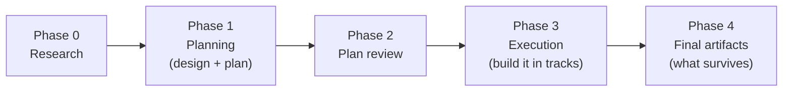
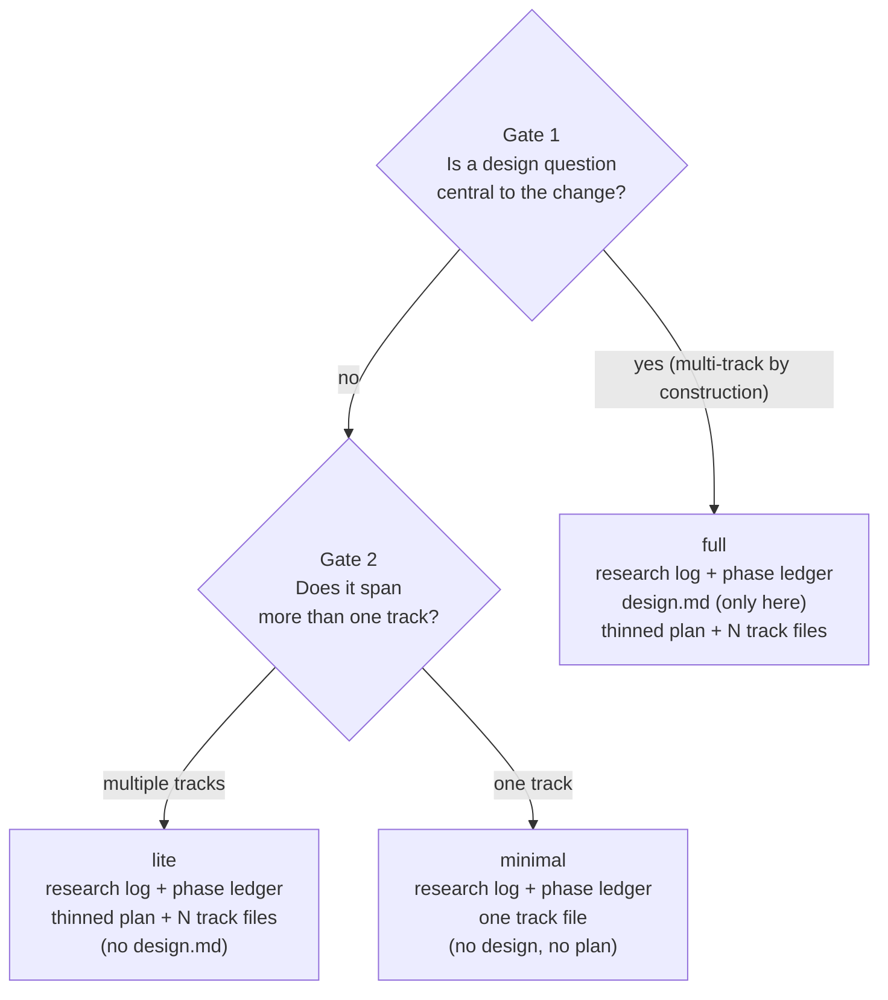
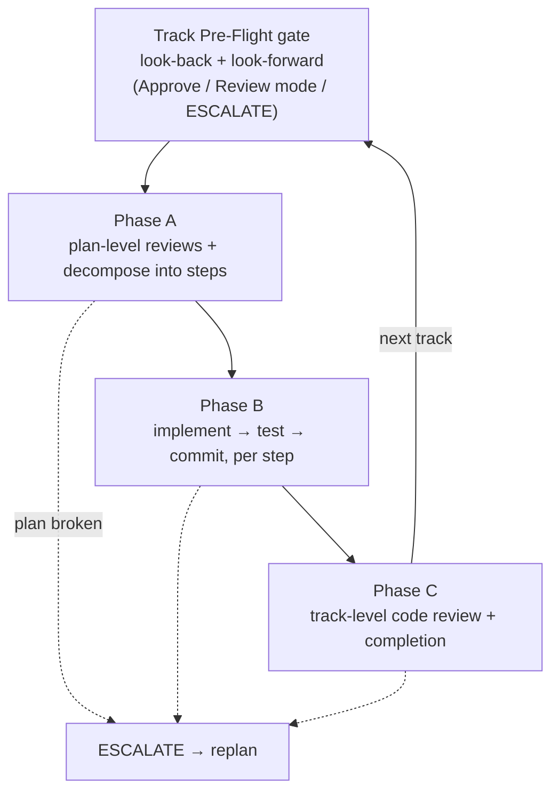
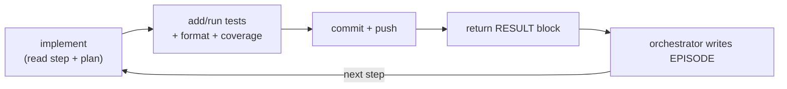
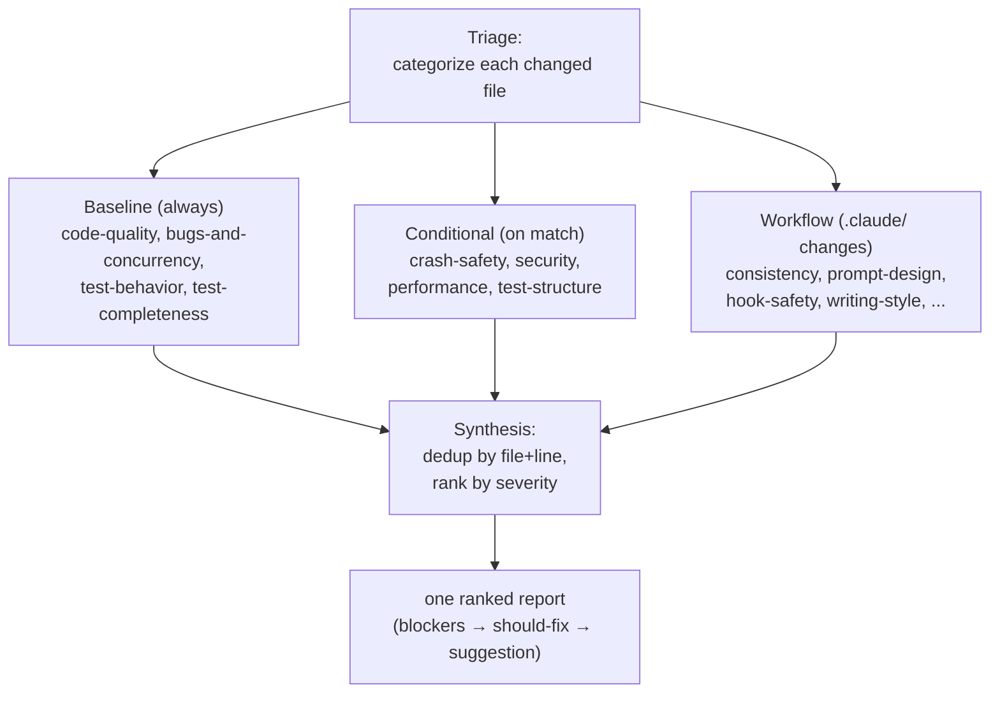
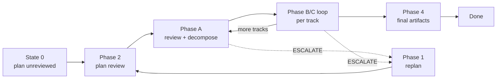

<!-- book-source-sha: 5eb5953386f37ea415100f1fdd27b5c8ef2ce0ff -->
# The YouTrackDB workflow — TL;DR

*A half-hour distillation of [Running the YouTrackDB development workflow](README.md), the 16-chapter book in this directory, into one readable article.*

> **About this summary.** This file condenses the book's main ideas and the gist of each phase into a single read. The [chapters](chapters/) stay authoritative; this summary drops detail on purpose. It reflects the book as of commit `5eb5953` (the last commit touching `docs/workflow-book/` source when it was written; see the stamp on line 1). When the book changes, refresh this file with the `update-workflow-book-tldr` skill instead of hand-editing it section by section.

The workflow is a set of prose procedures (under `.claude/workflow/`) plus a handful of skills that take a code change from the first request to a merged result. Its goal is to make non-trivial changes reviewable, recorded, and trustworthy. The machinery forces that discipline by default, so a good result does not depend on the engineer supplying the discipline themselves.

---

## 1. The two ideas everything rests on

Picture the same change handled two ways. One engineer reads a request, opens the files they *think* are involved, starts editing, and discovers halfway through that their assumed design doesn't hold; they patch around it, the diff grows, and a reviewer can't tell what was planned from what was improvised. The other writes down what they learned, settles the design before touching code, breaks the work into reviewable pieces, and has each piece checked as it lands. Both reach the same feature; only the second leaves a record of *why*.

The whole workflow is the machinery that makes the second way the default. Two pressures shape it:

1. **Front-loaded thinking.** Do the hard thinking in the order *research → design → plan → review*, so that by the time code is written the hard questions are already answered and on the record. A wrong assumption caught as a sentence is cheap to fix; the same assumption caught as an implementation is expensive.

2. **Finite attention.** An agent's judgment degrades as it holds more unrelated material. A session that just argued through a design will drag that argument into implementation, where it does not belong. So each phase runs in its own session, and the session is cleared at every phase boundary. Review and implementation never share a session; design-authoring and plan-derivation never share a session.

Idea (2) creates an obvious problem: if the session is wiped between phases, how does the next one know where it left off? The work writes its state to disk as it goes. A running **phase ledger** records which phase is finished, and per-piece notes hold the finer detail. The next session reads that state at startup and resumes itself, so you never hand-carry context across a boundary; the on-disk record does.

---

## 2. The five-phase shape

A change moves through five numbered phases, in order. Each has one job and finishes before the next begins.

- **Phase 0, research.** Explore the code and problem interactively; record findings in a *research log*. Planning rests on this recorded pass, not on a first guess.
- **Phase 1, planning.** Turn research into a frozen design, then derive a plan from it. The plan names the pieces of work and the order they must land in.
- **Phase 2, plan review.** Check the plan against the design, the actual code, and itself, before a line of code is written.
- **Phase 3, execution.** Build the change as a series of independently reviewable, mergeable slices called *tracks* (roughly one pull request each), landing in dependency order. This is the largest phase.
- **Phase 4, final artifacts.** Write down what survives the merge; delete the scaffolding that does not.

You do not invoke phases by number. Two skills drive them:

- **`/create-plan`** drives Phases 0–1 (research and planning).
- **`/execute-tracks`** drives Phases 2–4 (review, execute, close out). You re-run it once per piece of work.

Three roles do the work behind those skills: the *planner* (Phases 0–1), the *orchestrator* (Phases 2–4), and the *implementer* sub-agent the orchestrator delegates code work to.

---

## 3. Sizing the change first: the tier gate

Before any planning artifact is written, the workflow decides how much of itself the change earns. A one-line fix should not pay the ceremony of a durability rework, and a durability rework should not be allowed to skip it. Two yes/no questions, proposed by the agent and confirmed by you, route the change to a **tier**.

- **Gate 1, is there a real design question?** Answer yes only when one of seven categories is *central to the change's purpose* rather than brushed by an incidental edit: Concurrency, Crash-safety/Durability, Public API, Security, Architecture/cross-component coordination, Performance hot path, and Workflow machinery. A storage rework whose core problem is crash recovery is a yes; a rename that happens to edit a concurrent class is a no. *(These same seven categories reappear per-step as risk tags in Phase 3: one source of truth, read at two granularities.)*
- **Gate 2, how wide is it?** Does it fit in one reviewable, mergeable diff (single-track), or need several stacked, dependency-ordered ones (multi-track)? This is an estimate; if a track later balloons, the tier is upgraded in flight.

The gates collapse to three tiers (a design-needing change is multi-track by construction, so "design + single-track" is unreachable):

| Artifact | `minimal` | `lite` | `full` |
|---|---|---|---|
| Research log | ✓ | ✓ | ✓ |
| Phase ledger | ✓ | ✓ | ✓ |
| Plan (`implementation-plan.md`) | — | ✓ (thinned) | ✓ (thinned) |
| Track files | ✓ (one) | ✓ (N) | ✓ (N) |
| Design document (`design.md`) | — | — | ✓ |
| What survives the merge | PR-description summary | `adr.md` | `design-final.md` + `adr.md` |

The research log and phase ledger are universal, because the machinery that resumes and reviews a run depends on them. The plan and the design are what the lighter tiers shed. Knowing your tier tells you exactly which parts of the rest of the workflow apply.

> Keep the two small scales apart: the **change tier** (`full`/`lite`/`minimal`) is a one-time ceremony decision, while the per-step **risk tag** (`low`/`medium`/`high`) is applied during execution. They deliberately share no words.

A `minimal` change runs a stripped path: research, a single track file, a fast (usually silent) plan review, one implement-test-commit pass, a light review, and a two-line verdict folded into the PR as the scaffolding is deleted. That is the whole shape in miniature. Every phase still runs, just thinned. The rest of this article opens each phase in depth. As it does, watch for the two things the heavier tiers add: the frozen design document (`full` only) and the derived plan that coordinates multiple tracks (`lite` and `full`). Research, the per-track execution loop, review, and close-out are shared by all three tiers.

---

## 4. Phase 0 — Research before you plan

Research is an interactive pass: you drive, asking the agent to trace code, read modules, look up libraries. The agent explores but does not steer toward planning. It ends only when *you* say "create the plan."

Its single durable output is the **research log**, a decision *ledger* rather than a plan. Append-only sections record the verbatim initial request, a Decision Log (each entry carrying `**Why:**` and `**Alternatives rejected:**`), Surprises & Discoveries, and Open Questions. The log is the workflow's memory of why the change is shaped the way it is, and it survives every session clear.

A subtle rule: the log is kept **opaque to you during Phase 0**. Section names, decision IDs, and bracketed fields stay the agent's internal bookkeeping; everything reaches you as plain prose, so the conversation stays readable.

The Phase 0 → 1 boundary is a three-part gate:
1. **Completeness.** The agent logs any settled-but-unrecorded decisions and gives you a plain-language summary.
2. **Tier proposal.** It proposes `full`/`lite`/`minimal`; you confirm or override.
3. **Adversarial review.** A reviewer *attacks* the log: do the `**Why:**` fields hold up, are the rejected alternatives genuinely worse, is anything assumed but unverified? Blockers loop back to research (bounded to a few iterations); the verdict is recorded.

The payoff: decisions are challenged **once**, on the research log, before any artifact derives from it. No downstream document re-litigates them.

---

## 5. Phase 1 — Design first, then a derived plan

### The design document (`full` tier only)

In the `full` tier the design is authored first, reviewed, and frozen, all before any plan exists. This inverts the common habit of sketching a plan, building, then back-filling the design. Here the design is the *seed*, and the plan derives from it.

The design works at design level: classes, relationships, contracts, and the genuinely hard parts (concurrency, recovery, invariants), with Mermaid diagrams paired with prose. It names interfaces, not variables.

Every change to `design.md` goes through the **`edit-design`** skill; editing the file directly is forbidden. The skill bundles four atomic steps so no bad edit propagates silently:
1. **Apply** the change (and on first creation, stamp the file with the workflow commit it was built against).
2. **Auto-review.** A mechanical script catches structural violations, then a **cold-read** by a fresh sub-agent (one with no memory of the conversation) answers fixed comprehension questions ("what does this add, what must stay true, where is the subtle gotcha"). The cold reader stands in for the next human.
3. **Iterate.** Findings are graded *blocker / should-fix / suggestion*; the skill fixes the first two and re-reviews (bounded rounds). If blockers survive the budget, it hands the partial edit to you rather than papering over it.
4. **Present** the diff and append a one-line record to an append-only mutation audit trail.

Because Phase 0 already challenged the *decisions*, the design's own review is about **comprehension** rather than re-arguing choices. (If authoring surfaces a *new* load-bearing decision, it goes back to the research log and the adversarial gate first.)

When a genuine fork appears (a real choice between alternatives affecting architecture, API, data structure, algorithm, or contract that research has not settled), the agent **escalates to you**: it states the context, lays out at least two alternatives with trade-offs, recommends one, and waits. Routine work (mechanical edits, names following convention, prescribed details) it handles silently. Once Phase 1 ends, the design is frozen and never edited again; a later replan records new intent in the plan, and Phase 4 writes a separate `design-final.md` for what was actually built.

### From frozen design to plan and tracks

A *fresh* `/create-plan` session detects a committed, clean `design.md` with no plan yet, skips research, and resumes straight into **plan derivation** (the book's "Step 4b"). The plan is *derived* from the tracks rather than written on its own: a thin mirror that holds no fact the tracks already own (a component map plus a dependency-ordered checklist of tracks). The principle is single-source-of-truth: a fact written twice drifts. Decisions, invariants, and rationale live in the tracks.

A **track** is one pull request in a stacked, dependency-ordered series. The sizing rule is **maximize first**: pack self-contained units into a track up to a soft ceiling (~20–25 in-scope files), and open a new track only when the next unit would breach the ceiling or break independent mergeability. Each track pays a fixed tax (review, decomposition, code review, session boundaries), so fewer, fuller tracks pay it fewer times. Earlier tracks never depend on later ones (a directed acyclic order), and cuts prefer natural dependency seams.

Each track file is created in Phase 1 with its narrative sections filled (Purpose, Context, Decision Log, Plan of Work, Interfaces/Dependencies, Invariants), but its `## Concrete Steps` roster is left empty. Step decomposition is deferred to execution on purpose: the executor will know the codebase as it actually stands, including what earlier tracks turned up. A step roster at plan time would be a guess. A **cold-read** gates the plan and tracks before they persist.

Track files live at `docs/adr/<dir-name>/_workflow/plan/track-N.md` during a run, alongside the research log, phase ledger, and (in `full`/`lite`) the plan and design.

*(The `lite` tier skips the design and the separate session, authoring tracks directly from the research log in one Phase 1 session. `minimal` has no plan at all: one track file is the whole change.)*

---

## 6. Phase 2 — Reviewing the plan before any code

On a fresh plan, `/execute-tracks` reviews the plan before it implements anything. (It detects "State 0": the ledger shows no progress past planning.) A wrong plan caught here is cheap; caught after implementation, it is expensive. The review has two steps:

1. **Consistency review** *reads the code.* It checks design-to-code, plan-to-code, and design-to-plan, using the IDE symbol index to verify claims and producing verification certificates (claim, search, result, verdict). An *intent-axis pre-screen* separates "what should exist now" from "what a pending track will build," so it does not flag expected absences.
2. **Structural review** *reads no code.* It validates the plan's well-formedness: track ordering and dependencies, sizing, adequate descriptions, decision traceability, and bloat (per-section budgets).

An **autonomous classifier** tags every finding *mechanical* or *design-decision*:
- **Mechanical** = a claim about current state with exactly one correct fix that preserves intent → **auto-fixed silently.**
- **Design-decision** = ambiguity, contradiction, an unimplemented invariant, or multiple plausible fixes → **escalated to you, batched.**

After fixes, a **gate verification** re-checks each finding (fixed correctly? any regression?). The loop runs at most three iterations; if blockers survive, it escalates with a recommendation to return to planning. A human-readable `plan-review.md` audit trail is always written; the machine-readable verdict is the ledger boundary that lets the next session skip the review. `/review-plan` re-runs this on demand when the plan changes mid-flight.

---

## 7. Phase 3 — Executing a track (sub-phases A → B → C)

Phase 3 is where code is written, one track at a time, and each track runs through three lettered sub-phases. (Numbered phases 0–4 run *once per change*; lettered sub-phases A/B/C run *once per track*.)

### Phase A — pre-flight, review, decompose

Each track opens with the **Track Pre-Flight gate**, which both looks back and looks forward before you commit to the track. As a track runs, it records an **episode** for each step: a durable note of what was done and learned. Looking back, the gate reads the episodes from earlier tracks and returns a verdict: `CONTINUE`, `ADJUST`, or `ESCALATE`. Looking forward, it previews the coming track. You get three choices rather than a yes/no: **Approve**, **Review mode** (a conversational refinement loop where you layer observations and the orchestrator silently sorts them into typed actions, surfacing the whole set for approval before anything lands), or **ESCALATE** (replan).

Then the track gets plan-level reviews, reading the plan against real code rather than a diff:
- **Technical review.** Do the named components exist, with the expected shapes, without breaking existing callers? Evidence certificates are required. Runs at every tier.
- **Adversarial review.** Narrowed: it does not re-litigate Phase 0–1 design decisions; it challenges the track's *realization* (file footprint, step sizing, outputs from earlier tracks, invariant violations).
- **Risk review.** Traces critical paths (storage, WAL, transactions, indexes, cache): what breaks per step, what safeguards exist, can each step be tested? Runs when the track warrants it.

Finally, **decomposition** turns the rough scope sketch into a numbered **step roster**. Two rules govern it: risky steps stay *isolated* (no file cap, so the whole risky change sits in one step and review sees it whole); low-risk work is *merged* toward ~12 edited files per step. Each step gets a **risk tag**: `high` (any of the seven categories), `medium` (observable behavior change across files, test-infra, error-handling), or `low` (pure refactor, new tests, docs). The default is "when in doubt, high," and the tag locks once the step is implemented.

### Phase B — the implement-test-commit loop

This is the core working beat. For each step, the orchestrator spawns a fresh **implementer** sub-agent (on the strongest model) and delegates all the messy work to it, keeping its own context clean. The implementer follows an immutable order:

Every commit is a fully-tested unit, and every commit is pushed immediately (the draft PR stays in sync; a lost laptop never costs work). The implementer returns one structured **`RESULT` block** (outcome, commit SHA, touched files, test summary, draft episode). A silent exit counts as a failure.

The orchestrator then:
- **Reviews high-risk steps now** by spawning dimensional review agents (see §8); `medium`/`low` steps lean on the track-level review instead. This is how the risk tag distributes scrutiny.
- **Checks cross-track impact.** Did this step weaken an assumption a later track depends on? Small impacts are noted in the episode; large ones escalate to replanning.
- **Checks context pressure.** If running hot, it pauses at the step boundary rather than degrading.
- **Writes the episode** into the track file's `## Episodes` section, not the phase ledger: What was done, Key files, and optionally What was discovered / What changed from the plan / Critical context, stamped with the commit SHA and a context-level marker. Episodes are immutable; corrections append to later steps. Cross-cutting discoveries are promoted into the track's `## Surprises & Discoveries` log.

The episode is the load-bearing artifact: it is the only thing on disk that explains the *why* behind a commit, so a fresh session can resume without losing adaptive discoveries.

### Phase C — track-level review and completion

After all steps, the orchestrator runs a review over the **entire cumulative diff** of the track (start → HEAD), which catches cross-step interactions no single-step review could see: a producer and consumer split across steps, architecture that drifted one step at a time, integration gaps. *(A one-step track whose step is already `high` and was reviewed in Phase B skips this; the skip is gated on the step having been reviewed, not on step count.)*

Fixes are driven through the same dimensional-review iteration loop via a fresh implementer (commits prefixed `Review fix:`); the orchestrator never edits source here. Then comes the **review-mode approval loop**: you are shown three choices, Approve / Review mode / ESCALATE, and can layer questions (answered inline) and fix requests (each spawns an implementer) before signing off.

A load-bearing detail: **nothing about completion is written until you approve.** If the orchestrator marked the track "done" and *then* waited, a resumed session would skip your review. By deferring all completion writes, an interrupted session simply re-presents the same approval step (the resume signal is "steps all checked off, but the ledger has not advanced"). On approval, three things land together in one commit: an optional plan-correction commit (so out-of-scope findings are not lost), the **track completion episode** (a strategic summary synthesized from all step episodes), and the **phase-ledger boundary** advancing to the next track.

---

## 8. The review mechanism: dimensional agents

A code review here fans out across **dimensional review agents**: each reads the *same* diff through one lens, and their findings are **synthesized** into a single ranked report. No dimensional agent edits code; each only reports.

- **Triage-based selection** runs first: each changed file is categorized (for example `storage-engine`, `concurrency`, `crash-durability`), and categories map to reviewers. A crash-safety reviewer on a string-format fix is just noise, so it does not run.
- **Severities** collapse to three: **blocker** (fix before proceeding), **should-fix** (before merge), **suggestion**. Reviewers' native scales map in via a fixed table; only *upgrades* are allowed.
- **Stable finding IDs** (per dimension, for example `CQ`, `BC`, `CS`, `SE`, `PF`) survive across iterations so fixes can reference them.
- **Synthesis** collapses findings at the same file+line into one bucket (keeping every contributing ID), and applies an upgrade-only backstop that re-reads each finding's rationale and bumps severity if the stated impact exceeds the label (a real CI-hang marked "suggestion" gets promoted). The output is one ranked report rather than seven separate transcripts.
- The **review iteration loop** is capped at three: iteration 1 is the full review; later iterations are *cheap gate checks* where each reviewer verifies only its own findings against the fix commit (verdicts: VERIFIED / REJECTED / MOOT / STILL OPEN / **REGRESSION**). The cap prevents infinite spinning; surviving blockers escalate.

This same mechanism is what Phase B (high-risk steps) and Phase C (whole track) both invoke.

---

## 9. Phase 4 — What survives the merge

When every track is complete, a fresh session closes out. It reads the *executed code* (via the IDE symbol index, on the principle that "the plan is a map, code is fact") rather than transcribing the old plan, and produces the tier-specific durable artifacts:

- `full` → `design-final.md` + `adr.md` (filed under `docs/adr/`)
- `lite` → `adr.md`
- `minimal` → a verdict summary folded into the PR description

Three rules shape this step:
- **Ephemeral-identifier removal.** All scaffolding identifiers (`Track 3`, `Step 2`, finding IDs, `_workflow/` paths) are rewritten into prose, file/class references, or commit SHAs, so the artifact reads cleanly to someone who never saw the scaffolding.
- **Adversarial-verdict fold.** The verdict from the research log's adversarial gate is copied (just the verdict and iteration count) into the durable carrier *before* the log is deleted, preserving the evidence that the change was vetted pre-code.
- **Cleanup commit.** `git rm -r` the entire `_workflow/` directory, so after a squash-merge only the code change and the durable artifacts land in `develop`.

Workflow-modifying branches carry an extra wrinkle. Edits to `.claude/` are **staged** under `_workflow/staged-workflow/` during execution, which keeps the live workflow stable while you run it, and a **promotion commit** copies them into the live tree at the end. A *rebase-precedes-promotion* check guards that copy so it never clobbers workflow fixes that landed on `develop` meanwhile. The workflow stops short of flipping the PR to "ready"; you do that by hand.

---

## 10. The backbone: phases, sessions, and the phase ledger

Everything above depends on one mechanism that makes a wiped session resumable.

- The **phase ledger** (`phase-ledger.md`) is an append-only event log: one line per boundary, never rewritten. Readers use **last-value-wins**, scanning all lines and keeping the newest value of each key (`phase`, `track`, `tier`, `categories`, staging mode, `paused`). Mid-flight changes append; they never edit history, so the ledger cannot be corrupted.
- Within-track sub-state (step count, review iteration) lives in the track file's `## Progress` section, and the prose-heavy per-step episodes live in that same track file's `## Episodes` section. Both are kept out of the ledger so the one file every session scans on startup stays thin and fast. Resume state therefore lives in **two files**, `phase-ledger.md` and the track file, across **three locations** that split by write-frequency: the ledger ticks at phase/track boundaries (rare), the track file's `## Progress` at step boundaries, and its `## Episodes` accumulates the write-once-per-step durable record.
- At startup, the orchestrator reads the ledger and routes the session to the right phase/sub-phase. This auto-resume is what makes "clear the session at every boundary" practical.

---

## 11. When things go off the happy path

The workflow has **named protocols** for the predictable failures, rather than improvising. Three matter most: inline replanning (ESCALATE), context-window management, and the two-failure rule.

### 11.1 ESCALATE — inline replanning

ESCALATE is the workflow's one back-edge from execution to planning. It re-opens planning *without discarding completed work*: every finished track and every episode is kept, and only the part a discovery invalidated is reworked.

**When it fires (three triggers).** (1) The Track Pre-Flight gate returns ESCALATE, either because its look-back flagged that accumulated discoveries broke the remaining plan and you accepted that, or because Review mode surfaced a *deep* amendment (edit a Decision Record, add a whole new track, change how one track's scope bleeds into another). (2) Cross-track impact monitoring catches a foundational assumption that broke *after* a track already shipped. (3) A step fails at a level no further commit can fix, so the track's whole approach is wrong. A boundary keeps it from over-firing: *adding* a track is "deep" and routes here; *removing* a track (`[~]` skip) is "light" and does not.

**How you're involved.** The agent detects and proposes, but you stay in the decision. The Pre-Flight gate offers ESCALATE as an explicit choice; the terminal-step-failure case presents both failed episodes and waits for your call (rework the step vs. ESCALATE the track); and even the cross-track case runs an **ASSESS** move first (the "user's window") that lays out every episode, exactly what broke, which tracks are affected, and which decisions weakened, *before* any rework is drafted.

**Where the six moves run.** All six moves (**stop → assess → propose → review → iterate → resume**) execute inside the single session that triggered ESCALATE; that session drafts and commits the revised plan itself, with new code claims verified through the IDE rather than text search. Move 4's structural-review preview is *advisory*, a fail-fast smoke test rather than the real gate. Ending the session is the final act of move 6 (**resume**): it appends `phase=0` to the ledger (last-value-wins resolves to "back at plan review"), commits the revised plan and ledger reset, pushes, and ends. The next `/execute-tracks` re-runs the *full* Phase 2 (consistency + structural) on the revised plan before resuming, so a replan never blesses itself; a fresh session validates it. (If three preview iterations cannot clear the blockers, the session instead advises restarting from Phase 1 with the episodes as input.)

Throughout, the frozen `design.md` is never re-edited; new intent is recorded as *revised decision records* (Original / What changed / Revised) in the affected tracks, and Phase 4's `design-final.md` reconciles the divergence.

### 11.2 Context-window management

Context consumption is checked after each intermediate action against fixed levels (`safe` < 25% / `info` 25–39% / `warning` 40–49% / `critical` 50%+). The levels are **mandatory**: at `warning`, the agent must not start the next unit of work. It commits everything, writes a **handoff file** (capturing volatile state and the exact text to re-present next session), and tells you to `/clear` and re-run.

### 11.3 The two-failure rule

A failing step is marked `[!]`, and a retry is appended naming a *different* approach. If the same logical step fails a second time, the agent **stops**: two consecutive failures is the budget, and the third decision (rework the step vs. ESCALATE the track) is yours.

---

## 12. Keeping a long-lived branch current: drift

A branch can run for weeks against a workflow that keeps evolving on `develop`. Three machines keep it honest:

- **Workflow-SHA stamp.** Every derived artifact carries `<!-- workflow-sha: ... -->` on line 1, recording which workflow version it was written against. (Append-only logs and final artifacts are not stamped.)
- **Drift detection** at startup compares the oldest stamp reachable from `HEAD` against later commits touching workflow paths. If the branch has fallen behind, a **drift gate** forces a choice: *migrate* (end session, run `/migrate-workflow`), *defer* (todo + continue), or *suppress*.
- **`/migrate-workflow`** replays the intervening workflow commits **oldest-first**, classifying each (`format` / `file-rename` / `no-op`), applying the matching edit, advancing every stamp, and recording progress in an order that makes it **crash-resumable**. It stops to ask you only on genuine data-loss cases, and never commits on your behalf.

A separate **branch-divergence gate** protects against silent backup loss: if a branch is *both* ahead of and behind its own upstream, it forces a resolution (force-with-lease, reset, or defer) rather than losing pushes.

---

## 13. Two cross-cutting standards

- **House style.** Every artifact follows a prose discipline that strips "AI-tells": bottom-line-up-front, banned vocabulary (*delve*, *realm*, *foster*…), banned sentence patterns (negative parallelism, throat-clearing, trailing hedges), em-dash discipline, and bullets reserved for genuine lists. It scales by audience (full style for Markdown/PRs/issues, an "AI-tell subset" for code comments, a chat register for terminal replies) and is enforced in layers: a **mechanical regex check**, a judgment-layer **`ai-tells` skill**, and a **`review-workflow-writing-style`** dimensional agent.
- **Self-improvement reflection.** At session end the agent asks "what was harder than it should have been?" and may file a **YouTrack issue** against the workflow itself, but only through two filters that keep signal high: a **severity floor** (medium+, with evidence of recurrence) and an explicit **cost-benefit gate** (the friction must cost more than the fix's permanent load on every future session). Survivors are deduped and **capped at one issue per session** (zero is the expected outcome). This is the loop by which the workflow improves the workflow.

---

## The gist in five sentences

1. **Think before you build, in order** (research, design, plan, review), because mistakes are cheap as sentences and expensive as code.
2. **One phase per session, cleared at every boundary**, so each job runs with uncontaminated attention; the append-only **phase ledger** on disk is what lets a wiped session resume itself.
3. **Size the change first** with the two-question tier gate, so a one-liner sheds the ceremony a durability rework keeps.
4. **Execute track by track** through review → decompose → implement-test-commit → review, with a fresh implementer per step and an **immutable episode** as the durable record of *why*.
5. **Reviews fan out into dimensional specialists**, synthesized into one ranked report, with risk tags concentrating scrutiny exactly where automated tests are weakest.
